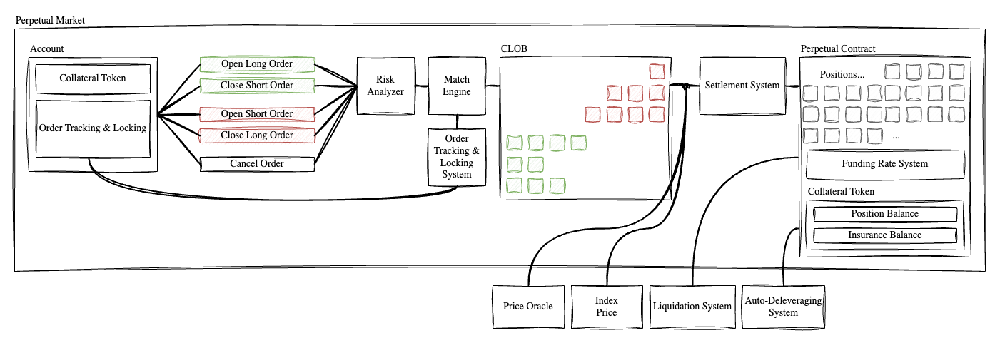

# Architecture

Perpl’s protocol architecture consists of multiple on-chain systems that work in tandem to deliver the highest-quality perp trading experience.

<figure><figcaption></figcaption></figure>

These systems include:

1. **Order book**: to match buy and sell orders using price-time priority. Every trade is matched and settled on-chain.
2. **Margin**: validates collateral, ensuring that traders always have sufficient funds to open and maintain a trade.
3. **Liquidation System**: continuously monitors positions and triggers liquidation when accounts fall below maintenance margin.
   1. **ADL & Insurance Fund**: protects protocol from large trading anomalies and helps protect traders from large market fluctuations.
4. **Funding Rate**: periodic (hourly) payment exchanged between long and short traders to ensure that the price of the perp aligns with the actual price index of an asset.
5. **Price Index**: aggregate and process external spot price data from multiple exchanges to generate an accurate index price.

We will dive deeper into each of these concepts in the rest of the documentation.
