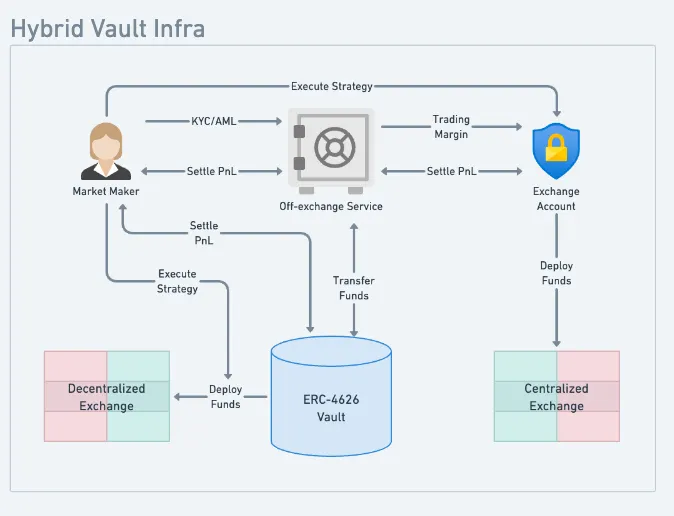

# Vaults: PLP

Vaults are passive investment strategies on Perpl that also help bolster the exchange's liquidity and safety.&#x20;

PLP's primary purpose will be to provide deep liquidity to the order books, and it can also be used as backstop liquidity, depending on asset, market, and risk conditions.&#x20;

### Technical Specifications

* Standard ERC-4626 Vault
* Depositors get LP tokens
* Margin/Deposit collateral: AUSD
* Withdrawal delay: 7 days
* Deposit schedule: weekly post-fee/reward distribution
* Fees are distributed via the smart contract, weekly
* Strategies can be run on-chain or off-chain at the discretion of the curator
* Funds have to stay on-chain and in-vault (no bridging externally)

<figure><figcaption></figcaption></figure>

### Why Hedge?

Market making is a risky endeavor, and taking directional risk to provide deep liquidity on Perpl can lead to massive drawdowns and/or losses. Leveraging [Fireblocks OES](https://fireblocks.com/platforms/off-exchange/) allows the vault curator to offload some of the risk on other venues, primarily centralized exchanges.&#x20;

<figure><figcaption></figcaption></figure>
